## SSH и утилиты

### Задание №2
Загружу на удаленную машину исполняемый файл с веб-сервером

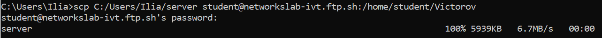  

Переименую исполняемый файл в server4 и задаю право на исполнение 
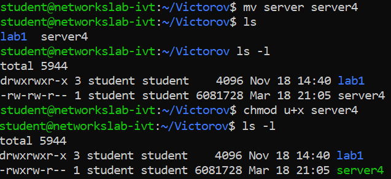  

Использую netstat -tlpn, чтобы увидеть, какой порт слушает сервер
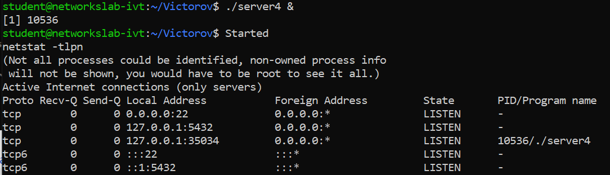   

Откроем этот порт в браузере (http://networkslab-ivt.ftp.sh:35034)
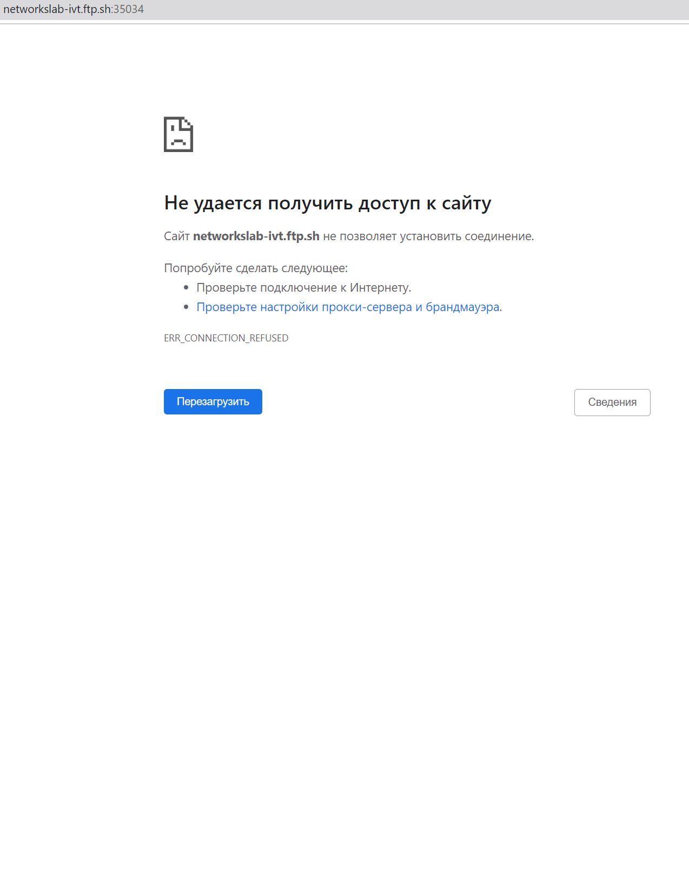  

Использую SSH port forwarding, чтобы получить доступ к порту и открыть страницу.  
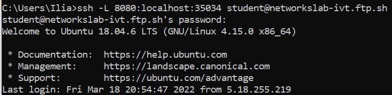  

Следуя инструкции, загружаю картинку на сервер  
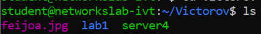  

### Задание №3
Сгенерирую ключ 
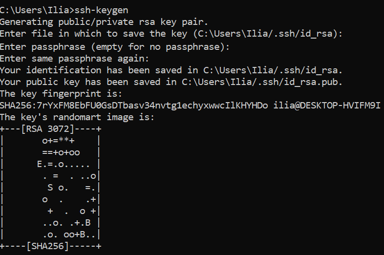  

Загружаю ключ на удаленную машину  
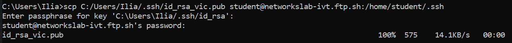    

Добавляю ключ в авторизованные 
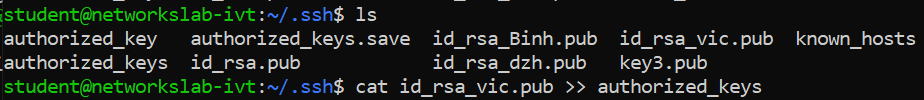    

Убеждаюсь, что авторизация по ключам работает    
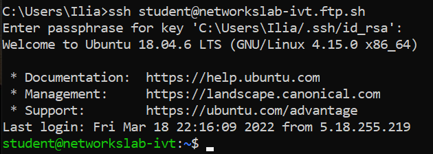    

### Задание №4
Запустил Wireshark, включил сниффинг на нашем основном сетевом интерфейсе.
В фильтр ввел hhtp
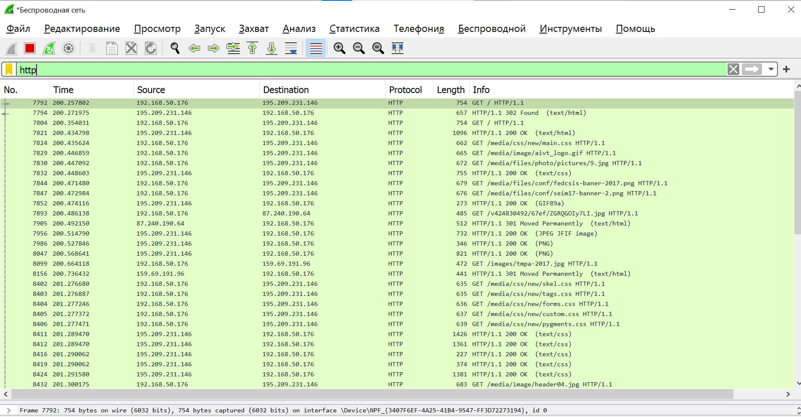  

При заходе на сайт кафедры, http пакеты имеют следующий вид:
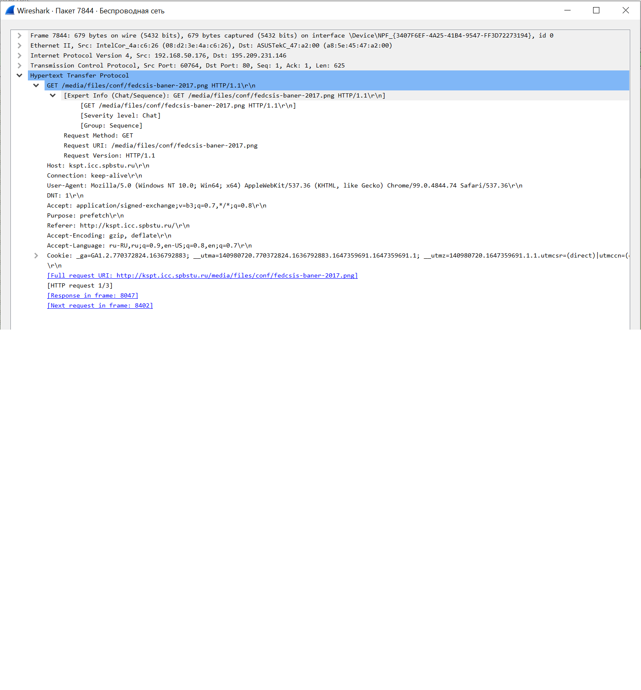  

Включил фильтр по tls и, при заходе на сайт университета, нашел сообщения Client Hello и
Server Hello
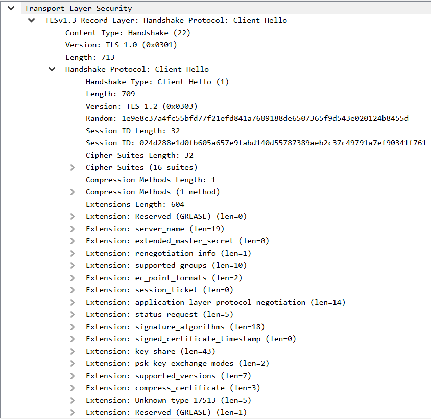    
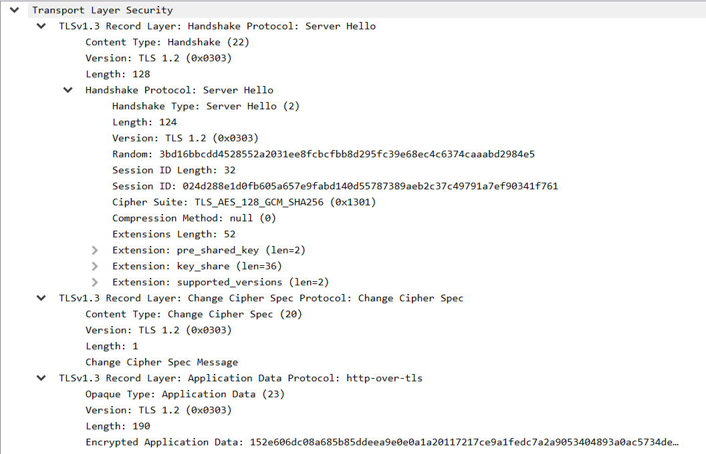    

При использовании фильтра по dns, запросы и ответы имеют следующий вид
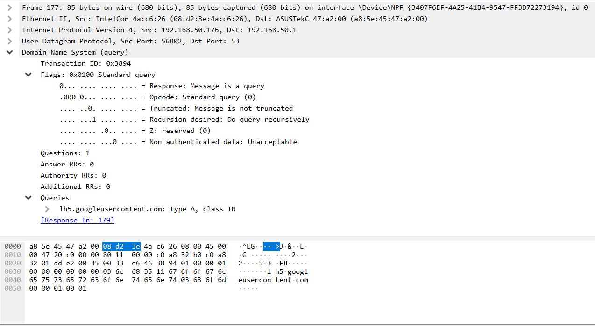  
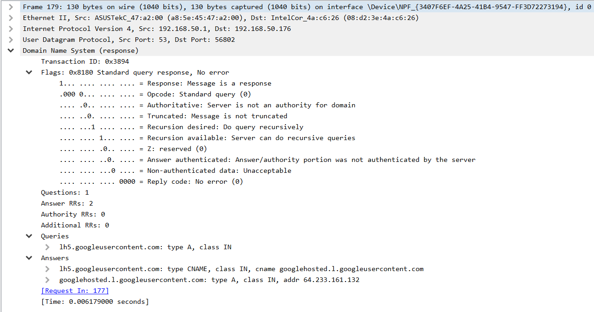    
 