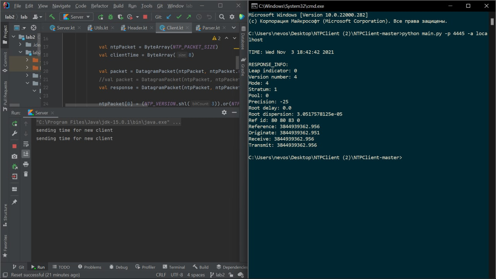

# NetworksLab2021 - Лаб1 Фам Тхи Тхань Бинь 3530901\80101

## Описание протокола

* 10 байт на заголовок, в котором передаётся размер
* Для операций подключения, отключения клиентов , а также передачи файлов передаётся специальный заголовок CONNECT, DISCONNECT, SEND_FILE 
* После считывания размера сообщения - заголвка, считывается сообщение

## Структура клиента и сервера

### Сервер

* Сокет на 127.0.0.1:10000
* Хранит список подключенных клиентов

#### main:

* Слушаем подключающихся клиентов и создаём им потоки
* Оповещаем других клиентов о подключении новых клиентов
* Если хочет подключиться новый клиент с именем из списка подключенных клиентов, то отключаем его и выводим сообщение

#### sendToAll

* функция для отправки сообщений всем клиентам

#### notificationForClient

* Создаёт уведомление об отключении\подключениии для отправки другим клиентам

#### getMessage

* функция для получения сообщения
* Считывает заголовок сообщения
* В зависимости был ли обычный заголовок или заголовок с отправлением файла, по разному обрабатывает сообщение
* Если заголовк с отправлением файла : считываем размер заголовка файла, заголовок файла, сам файл
* Если обычный заголовок, то просто считываем сообщение
* Передаём считанные данные в формате { 'sendFile' : Boolean, 'header', 'data'}

#### handle_client 

* Функция для обработки сообщений клиента
* Считываем сообщение\файл, передаём другим клиентам 
* Пишем уведомление, что получили сообщение\файл

### Клиент

* Подключаемся к сокету на 127.0.0.1:10000

#### main

* Подключаемся к сокету
* Создаём имя
* Обрабатываем сообщения и  отправляем их на сервер 
* Создаём потоки

#### getMessage

* Функция для получения сообщения
* Считываем заголовок, дальше в зависимости от того какой заголовок ( сообщение или файл ) , по разному  обрабатываем
* Формируем время получения 
* Формируем итоговое сообщение 

### Тестирование и демонстрация работы 

При подключения необходимо ввести имя пользователя, чтобы отправить файл надо написать send fileName.txt , указать имя файла и разрешение 

Сообщения на сервере, видим кто подключился и кто что написал

 

Вот так выглядят экраны клиентов:

Попробуем подключиться с уже существующим именем: 

Как видим сервер отключил нас, и написал, что  нужно поменять имя

Теперь попроюуем отправить файл

Вот так выглядит раюочая директория 

Как видим файл image.jpg находится в папке client1 

Теперь напишем в чат send image.jpg от имени пользователя запущенного из папки client1 

Вот такое сообщение появится на сервере

Вот такое сообщение появится у других пользователей

И вот так будет выглядеть рабочая директория, как видим файл появился только у клиента запущенного в папке client2 , сервер не сохраняет у себя файл, только передаёт 

Теперь отключим одного пользователя :

Вот такое сообщение получат другие пользователи 

Вот такое сообщение напишет сервер

