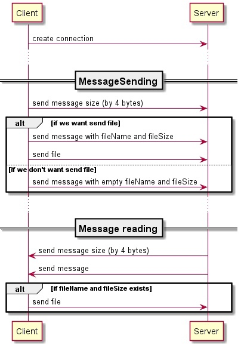

# Лабораторная работа #1
## Цель
Создать протокол для обмена сообщениями и позитивными картинками
## Ход работы
### Описание протокола
#####Алгоритм работы с протколом: 
- Устанавливаем соединение с сервером указывая для этого host и port
- Высылаем размер отправляемого сообщения в 4ех байтах (пример: размер 84, высылаем 0, 0, 0, 84)
- Высылаем сообщение, размер которого только что отправили (если отправляем файл, то добаляем его имя и размер в сообщении в полях fileName и fileSize)
- Если есть файл, высылаем его
- Ждем размер получаемого от сервера сообщения
- Получаем сообщение
- Если не пусты fileName и fileSize принимаем файл

Ниже представлена диаграмма работы протокола


#####Ограничения протокола

- Сообщение имеет формат: 
```
date : null , name : Nikita , text : Привет! Как дела? Я делаю домашнее задание на тему: компьютерные сети, а ты? , fileName : null , fileSize : null
```
Сервер проставит дату и вернет это сообщение.
В данной реализации клиента в итоге мы получаем: 
```
[2021-10-14][22:57:00][nikita]: Привет! Как дела? Я делаю домашнее задание на тему: компьютерные сети, а ты?
```
- В самом сообщении следует экранировать : и , с помощью \\
Пример: "bla\,bla\,bla\:bla"
- При проставлении даты, сервер заменяет все : на . (точки)
