## Отчет по практической работе «SSH и утилиты»

### Задание №1
Заглянем в файл /usr/local/src/task.txt.
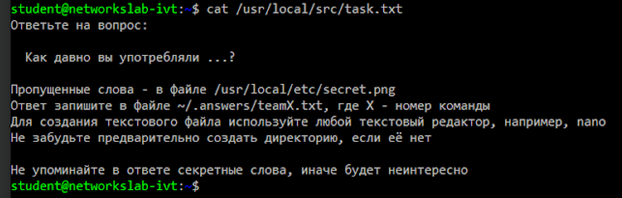  

Загрузим файл с сервера.
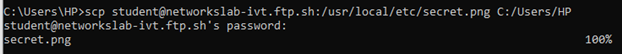  

Содержимое файла:
  

Запишем ответ на вопрос:
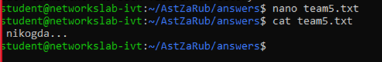  

### Задание №2
Загрузим на удаленную машину исполняемый файл с веб-сервером.
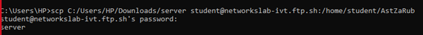  

Проверим, что файл оказался в нужной папке.
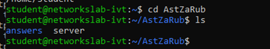  

Переименуем исполняемый файл согласно заданию.
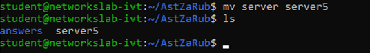  

Зададим файлу права на исполнение.
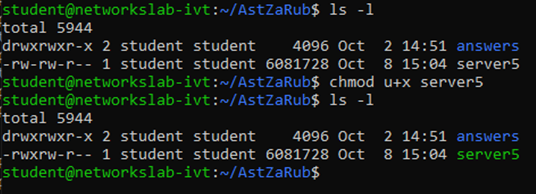  

Используем netstat -tlpn, чтобы увидеть, какой порт слушает сервер.
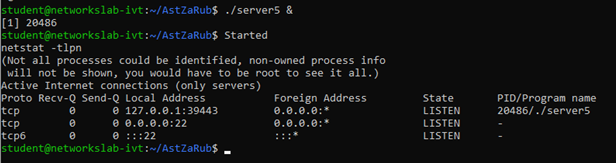  

Откроем этот порт в браузере (http://networkslab-ivt.ftp.sh:39443).
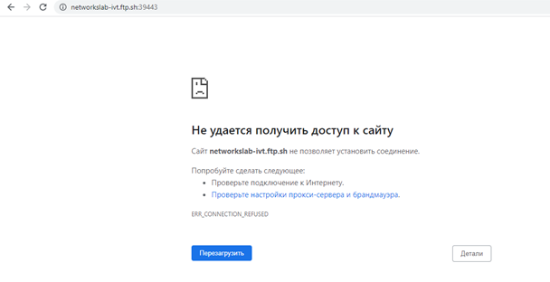  

Используем SSH port forwarding, чтобы получить доступ к порту и открыть страницу.
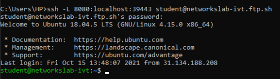  

Подключимся к удаленному серверу через локальный порт.
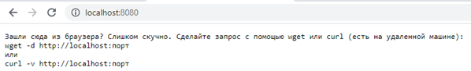  
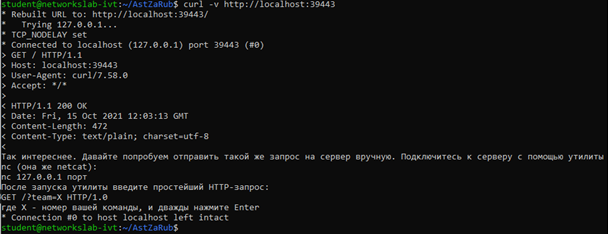  

### Задание №3
Сгенерируем пару ключей  
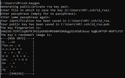  

Загрузим их на удаленную машину
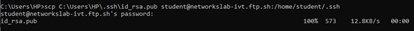  

Проверим, что ключи загружены.  
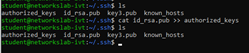  

Убедимся, что авторизация по ключам работает  
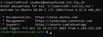  

### Задание №4
Запустили Wireshark, включили сниффинг на нашем основном
сетевом интерфейсе.  
Включили фильтр по http. Открыли сайт кафедры. Нашли даннный
запрос  
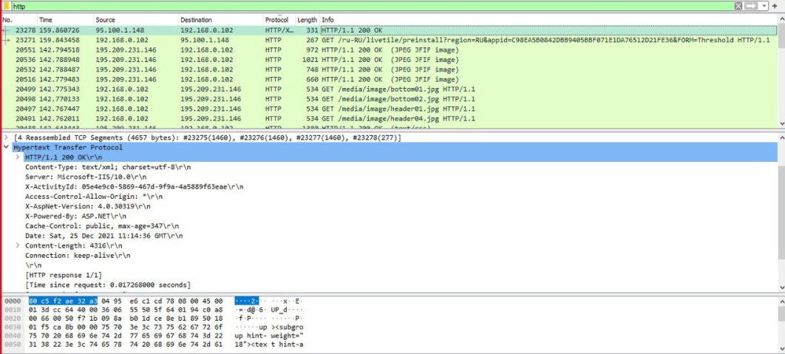 
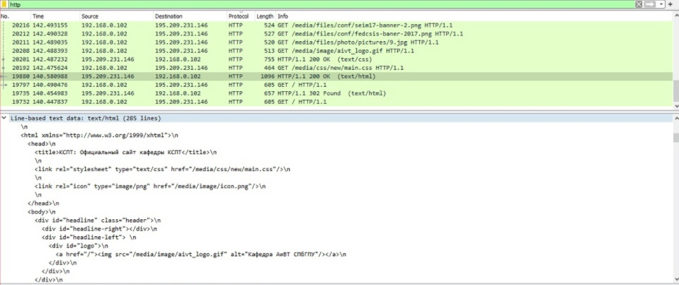 

Включили фильтр по tls. Открыли сайт с шифрованием. Нашли сообщения Client Hello и
Server Hello  
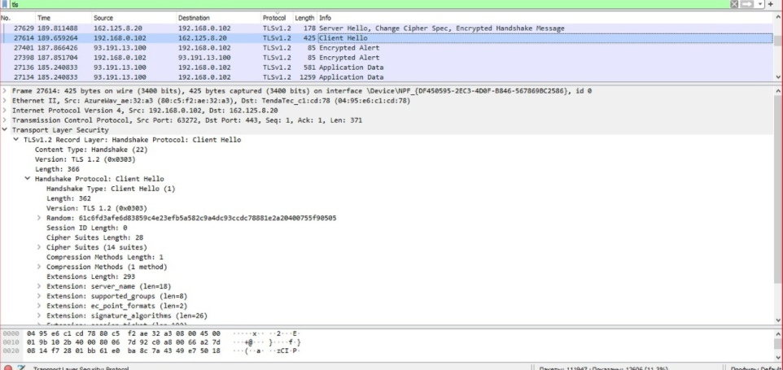   
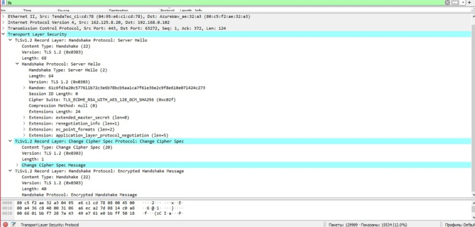  

Включили фильтр по dns.  
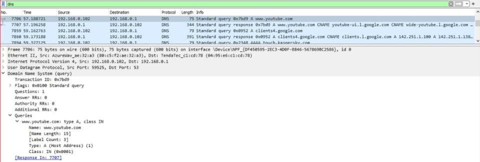   
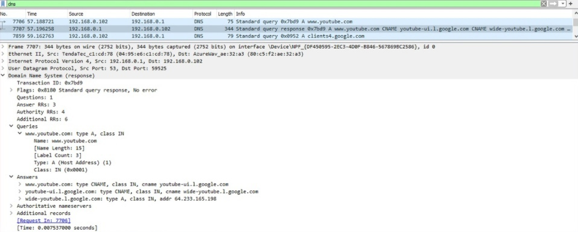   
 

